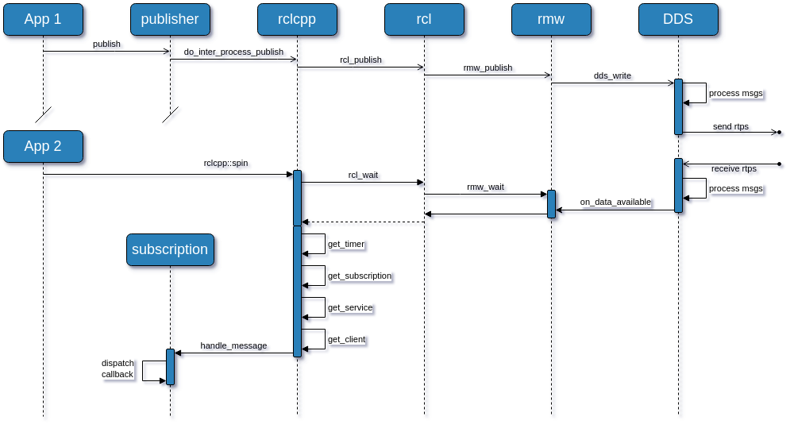

# Concepts

## Core Testing Principles

RTEST addresses fundamental challenges in ROS 2 testing by:

1. **Eliminating Inter-Process Communication**: Tests run in a single process, removing network-related flakiness
2. **Controlled Execution**: Direct control over message flow and timing
3. **Mock Entities**: Verification of node entities without actual RMW implementation

## Architecture Overview

RTEST provides mock implementations of ROS 2 entities that replace actual middleware communication with direct in-memory message passing, allowing for:

- Verification of publisher/subscriber creation
- Direct message injection to subscribers
- Controlled timer execution
- Service and client request/response testing

## When to Use RTEST

RTEST is ideal for:
- Unit testing ROS 2 nodes
- Testing time-dependent behaviors
- Verifying message publishing patterns
- Testing service implementations
